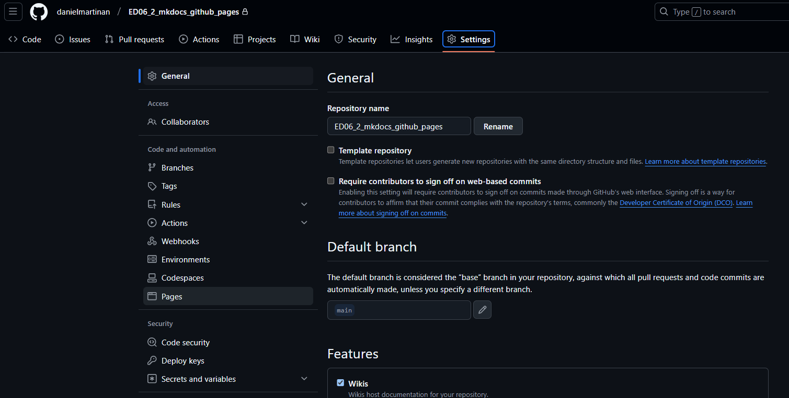
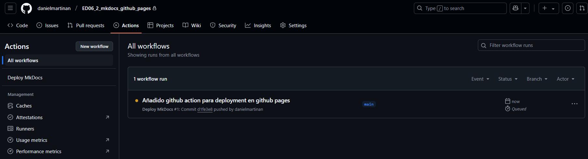
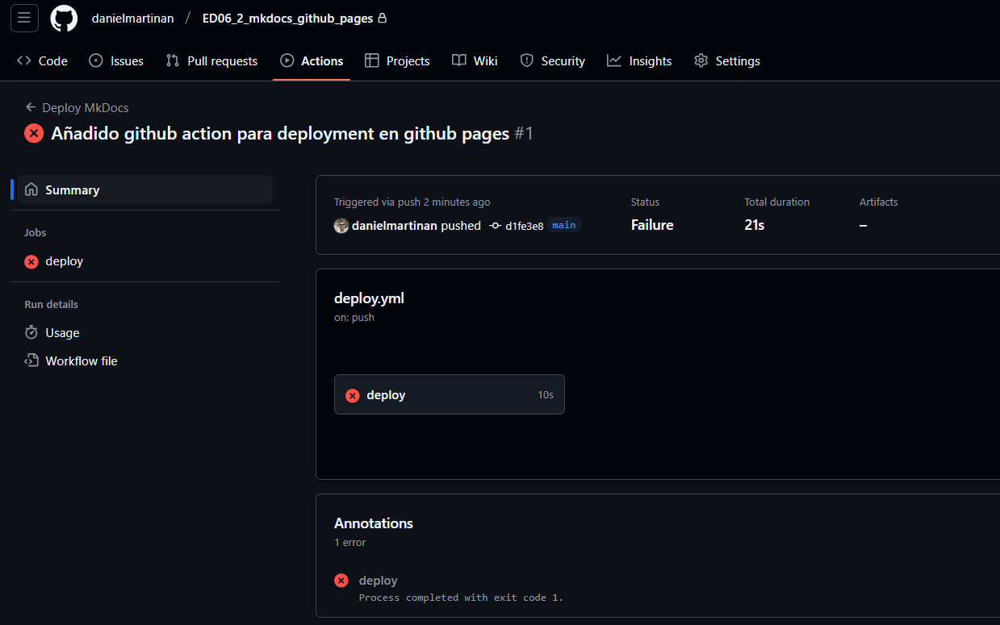

# ED06_2 - Integración de MkDocs con GitHub Pages

> [!NOTE]
> Este documento describe la tarea a realizar. En otras palabras, se trata de la descripción dada en el enunciado de la tarea.

## Introducción

En este ejercicio, aprenderás a crear una documentación profesional utilizando MkDocs y a desplegarla en GitHub Pages. MkDocs es una herramienta que te permite generar sitios web de documentación a partir de archivos Markdown. Por otro lado, GitHub Pages es un servicio de GitHub que te permite alojar sitios web estáticos de manera gratuita.

A continuación se detallan todos los pasos a seguir para crear tu documentación con MkDocs y desplegarla en GitHub Pages.

**IMPORTANTE:** en esta práctica se valorará el proceso seguido, por lo que es imprescindible documentar cada paso realizado, incluyendo las decisiones tomadas y los problemas encontrados. Tendrás que documentarlo en un archivo Markdown que en el último paso se añadirá a la wiki de tu repositorio de GitHub.

## Creación de Documentación con MkDocs y GitHub Pages

### Prerrequisitos

- Tener Git instalado en tu sistema
- Tener Python instalado (versión 3.7 o superior)
- Tener una cuenta en GitHub
- Tener conocimientos básicos de Markdown

> Si no dispones de Python instalado, puedes descargarlo desde [aquí](https://www.python.org/). Asegúrate de añadir Python al PATH durante la instalación.

### Paso 1: Configuración del Entorno

1. Primero, crea un nuevo directorio para tu proyecto:

```bash
mkdir mi-documentacion
cd mi-documentacion
```

1. Crea un entorno virtual de Python: un entorno virtual es una herramienta que te permite aislar las dependencias de tu proyecto para evitar conflictos con otras aplicaciones.

```bash
python -m venv venv
```

1. Activa el entorno virtual: lo hacemos ejecutando el siguiente comando en la terminal, que ejecuta el script de activación del entorno virtual. El comando varía según el sistema operativo:

**En Windows:**

```bash
venv\Scripts\activate
```

**En Linux/Mac:**

```bash
source venv/bin/activate
```

1. Instala MkDocs y el tema Material:

```bash
pip install mkdocs mkdocs-material
```

Puedes realizar todos estos pasos desde la consola de comandos de Visual Studio Code, sobre el directorio de tu proyecto.

> Pip es el sistema de gestión de paquetes de Python, que te permite instalar y gestionar las dependencias de tu proyecto. En este caso, lo utilizamos para instalar MkDocs y el tema Material.

### Paso 2: Crear el Proyecto MkDocs

1. Inicializa un nuevo proyecto MkDocs en el directorio actual:

```bash
mkdocs new .
```

1. Esto creará dos archivos importantes:
   - `mkdocs.yml`: El archivo de configuración
   - `docs/index.md`: Tu página principal

### Paso 3: Configurar MkDocs

1. Abre el archivo `mkdocs.yml` y configura el tema Material:

```yaml
site_name: Mi Documentación
theme:
  name: material
  features:
    - navigation.tabs
    - navigation.sections
    - navigation.expand
    - content.code.copy
```

### Paso 4: Crear la Estructura de Documentación

1. En la carpeta `docs`, crea la siguiente estructura de directorios y archivos:

```
docs/
├── index.md
├── guia/
│   ├── instalacion.md
│   ├── configuracion.md
│   └── despliegue.md
└── ejemplos/
    └── ejemplo1.md
```

1. Edita el archivo `docs/index.md`:

```markdown
# Bienvenido a Mi Documentación

Esta es la página principal de mi documentación.

## Contenido

- [Guía de Instalación](guia/instalacion.md)
- [Configuración](guia/configuracion.md)
- [Despliegue](guia/despliegue.md)
```

Luego, rellena el resto de archivos Markdown con el contenido que desees para tu documentación.

> Puedes utilizar a cualquier IA generativa para redactar el contenido de esta documentación sobre el tema que prefieras, o escribirlo tú mismo. El objetivo de esta práctica no es el contenido, sino el proceso de creación y despliegue de la documentación.

### Paso 5: Crear un Repositorio en GitHub

Haremos todo el proceso desde Visual Studio Code.

1. Inicializa Git en tu proyecto local. Ve al menú de control de versiones en Visual Studio Code y haz clic en "Initialize Repository". Esto creará un repositorio Git local en tu proyecto.

2. Crea un archivo `.gitignore` en el directorio raíz de tu proyecto con el siguiente contenido:

```
venv/
```

Con esto evitarás que el entorno virtual se suba a tu repositorio remoto, lo cual es una buena práctica.

1. Realiza el primer commit y vincula tu repositorio remoto. Desde el menú de control de versiones en Visual Studio Code, haz clic en "Commit" para realizar tu primer commit. Luego, haz clic en "Publish to GitHub" para crear un nuevo repositorio remoto y vincularlo con tu repositorio local.

### Paso 6: Automatización del despliegue: GitHub Actions

Crea un nuevo archivo `.github/workflows/deploy.yml` en el directorio raíz de tu repositorio con el siguiente contenido:

```yaml
name: Deploy MkDocs
on:
  push:
    branches: [ main ]

jobs:
  deploy:
    runs-on: ubuntu-latest
    steps:
      - uses: actions/checkout@v2
      - uses: actions/setup-python@v2
        with:
          python-version: '3.x'
      - run: pip install mkdocs-material
      - run: mkdocs gh-deploy --force
```

Con este archivo, se configurará un flujo de trabajo de **GitHub Actions** que desplegará tu documentación en GitHub Pages cada vez que hagas un push a la rama `main`. Puedes encontrar más información sobre GitHub Actions en la [documentación oficial](https://docs.github.com/es/actions).

### Paso 7: Configurar GitHub Actions

1. Ve a la sección "Actions" de tu repositorio, y selecciona la sección General.
2. En la sección Workflow Permissions, selecciona "Read and write access" para permitir que el flujo de trabajo pueda hacer push a la rama `gh-pages`.

### Paso 8: Configurar GitHub Pages

Abre tu repositorio en GitHub y sigue estos pasos para configurar GitHub Pages:

1. Ve a la configuración de tu repositorio en GitHub.



1. Navega a la sección "Pages".
2. En "Source", selecciona `Deploy from a branch`, y elige `gh-pages` como rama. Guarda los cambios.

### Paso 9: Desplegar la Documentación

1. Haz commit de los cambios en el archivo `.github/workflows/deploy.yml` y realiza un push a la rama `main` (puedes hacerlo desde Visual Studio Code o desde la terminal):

```bash
git add .
git commit -m "Configuración de GitHub Pages"
git push origin main
```

1. Ve a la sección "Actions" de tu repositorio para ver el progreso del despliegue.



1. Una vez completado, tu documentación estará disponible en:

```
https://tu-usuario.github.io/tu-repositorio
```

Es posible que surja algún error en el despliegue si no se han seguido correctamente los pasos anteriores. En ese caso, revisa los mensajes de error en la sección "Actions" de tu repositorio para identificar el problema.



El despliegue puede demorarse unos segundos, así que comprueba que el despliegue se ha realizado correctamente después de 30 o 60 segundos.

Puedes ver cómo se ha desplegado la documentación de este tutorial en [este enlace](https://danielmartinan.github.io/ED06_2_mkdocs_github_pages/).

## GitHub Wiki

Además de crear con MkDocs una documentación profesional, deberás documentar el proceso realizado en la wiki de tu repositorio. **Este paso es impresindible para la evaluación de esta práctica**, ya que se valorará la calidad de la documentación creada en la wiki, así como el nivel de detalle y claridad en la explicación del proceso seguido.

1. Añade una entrada `Home` a la wiki con una descripción general del proyecto, el objetivo de la práctica y un resumen de los pasos realizados.

2. Crea una página `Configuración` donde expliques detalladamente cómo configurar el entorno de desarrollo, incluyendo la instalación de Python, MkDocs y la configuración de GitHub Pages. Añade a esta página las capturas de pantalla correspondientes a cada paso.

## Recursos Útiles

- [Documentación oficial de MkDocs](https://www.mkdocs.org/)
- [Documentación del tema Material](https://squidfunk.github.io/mkdocs-material/)
- [GitHub Pages](https://pages.github.com/)

## Entrega

Añade un enlace a tu repositorio de GitHub donde se encuentre alojada la documentación así como a la documentación desplegada en GitHub Pages y a la wiki del repositorio. Asegúrate de que el repositorio es público para que pueda ser evaluado.

Añade todos los comentarios que consideres necesarios para explicar el proceso seguido, así como las decisiones tomadas a lo largo del proceso, en la entrada `Configuración` de la wiki de tu repositorio.
