# Configuración

> [!NOTE]
> En algunas imágenes se ha censurado la ruta de directorios y archivos de forma parcial por cuestiones de seguridad.

## Paso previo - Instalación de Python

Para instalar Python debe seguir los pasos siguientes:

1. Descargar el `Python installer manager` de la [página web oficial](https://www.python.org/downloads/).

2. Ejecutar el archivo de instalación `python-manager-26.2.msix`. Le aparecerá la siguiente ventana.

<div align="center">
 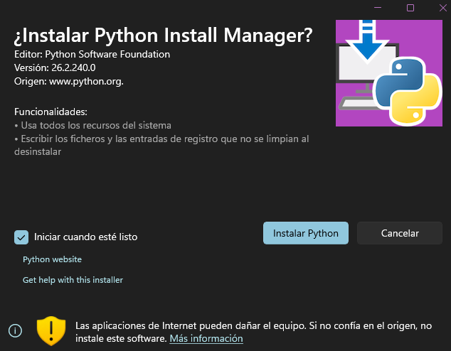
</div>

3. Pulse el botón `Instalar Python` para continuar. Cuando el instalador termine, se abrirá una terminal como la que se muestra a continuación.

<div align="center">
 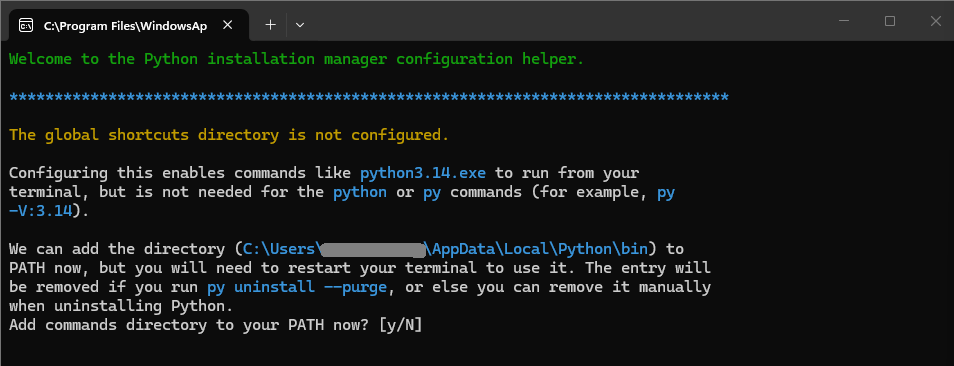
</div>

4. A continuación, pulse `y` a las dos preguntas que le hará el manager de configuración para instalar Python y configurar automáticamente la variable PATH.

<div align="center">
 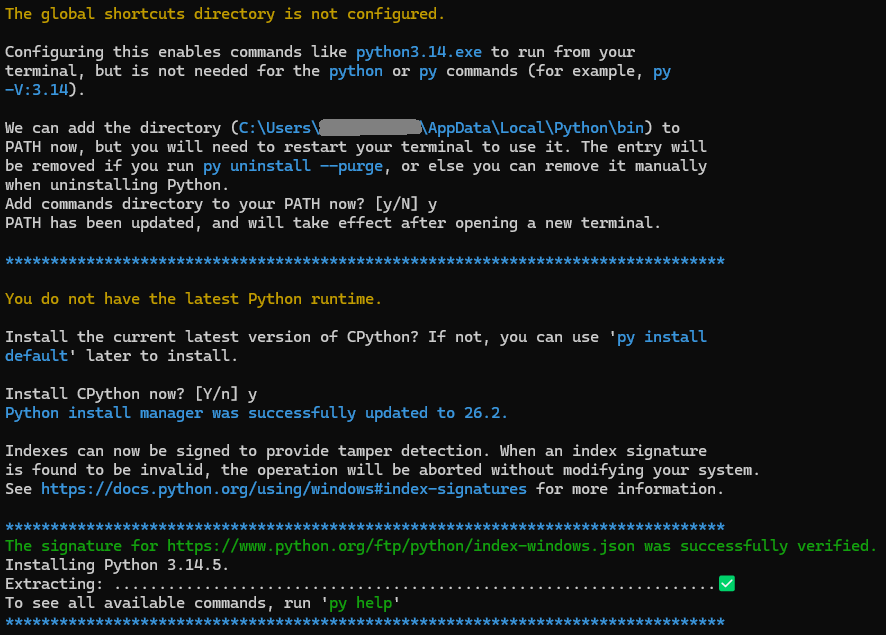
</div>

5. Para finalizar, debe pulsar `Enter` o `n` para rechazar la visualización de la ayuda online.

<div align="center">
 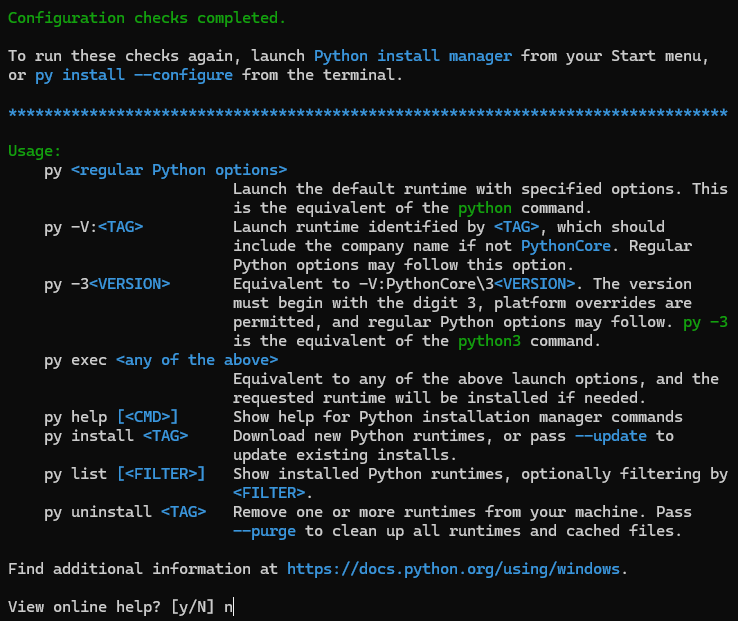
</div>

Para comprobar que la instalación se ha completado correctamente, puede ejecutar en la consola el siguiente comando:

```bash
python --version
```

Si todo está en orden, se mostrará la siguiente salida:

```console
> python --version
Python 3.14.5
```

## Paso 1 - Configuración del Entorno

1. Creamos el directorio `docs\` y nos posicionamos en él.

<div align="center">
 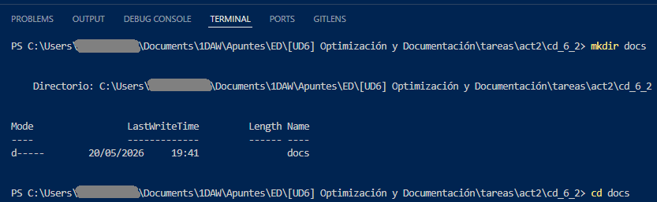
</div>

2. Creamos el entorno virtual de Python con el comando `python -m venv venv`.

<div align="center">
 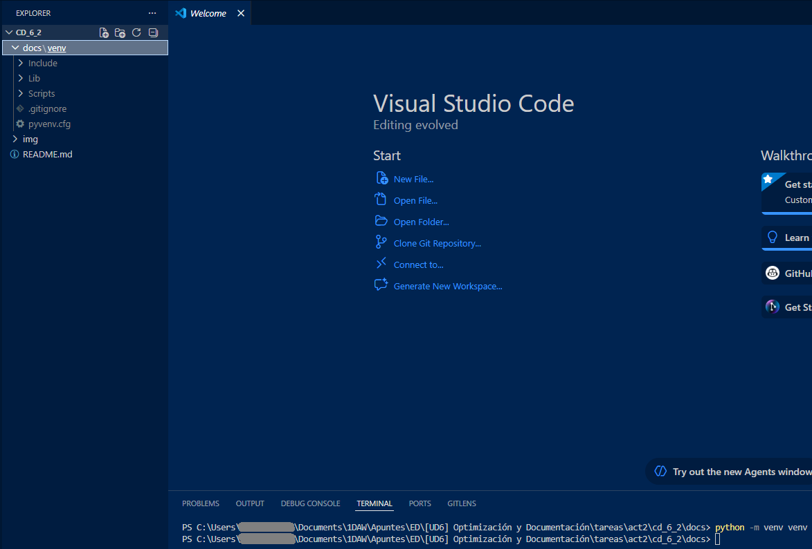
</div>

3. Activamos el entorno virtual mediante el comando `venv\Scripts\activate`. Al ejecutar el comando, se obtiene la siguiente respuesta:

<div align="center">
 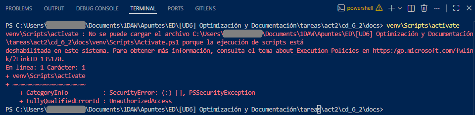
</div>

Para solventarlo, se tiene en cuenta la siguiente información obtenida en una búsqueda de Brave (respuesta proporcionada por Leo, el agente de IA de Brave):

> [!NOTE]
> `venv\Scripts\activate` : la ejecución de scripts está deshabilitada en este sistema
> 
> Este error ocurre porque **PowerShell** tiene por defecto una directiva de ejecución restrictiva que impide cargar scripts no firmados, como `Activate.ps1`. La solución más segura y recomendada es cambiar la política de ejecución para el usuario actual permitiendo scripts locales no firmados, pero exigiendo firma para los descargados de internet.
> 
> Abre PowerShell (preferiblemente como administrador si el cambio no surte efecto en la sesión actual) y ejecuta el siguiente comando:
> 
> ```powershell
> Set-ExecutionPolicy RemoteSigned -Scope CurrentUser
> ```
> 
> Al ejecutarlo, confirma el cambio escribiendo **S** o **A**. Una vez aplicado, puedes activar tu entorno virtual normalmente con `.\venv\Scripts\Activate.ps1`.
> 
> Si no deseas modificar la política global de PowerShell, una alternativa es cambiar el terminal predeterminado en tu editor (como VS Code) al **Símbolo del sistema (CMD)**, ya que utiliza el script `activate.bat`, el cual no está sujeto a estas restricciones de PowerShell.

Procedemos a seguir los pasos dados por Leo AI y obtenemos el siguiente problema:

<div align="center">
 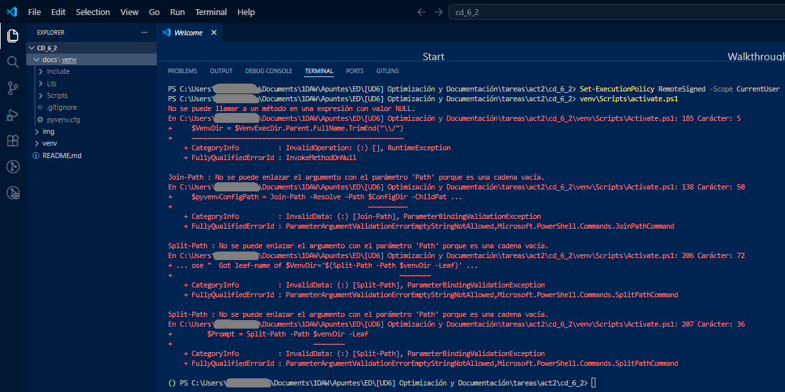
</div>

Para solucionarlo, simplemente editamos la carpeta que contiene los corchetes y ejecutamos de nuevo el comando `venv\Scripts\activate`:

<div align="center">
 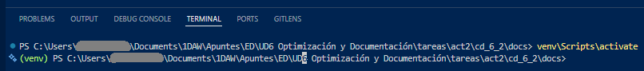
</div>

4. Instalamos MkDocs y el tema Material.

<div align="center">
 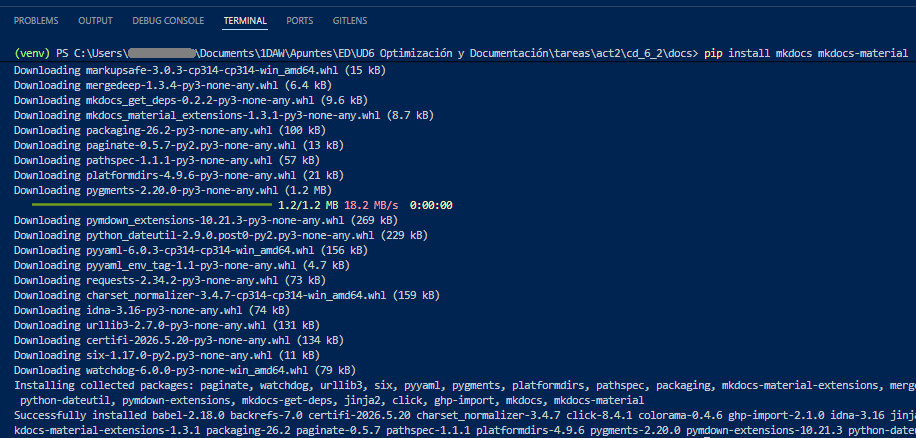
</div>

Con esto ya tenemos el entorno creado, activo y preparado para crear el proyecto MkDocs.

## Paso 2 - Creación del Proyecto MkDocs

Para inicializar el proyecto MkDocs ejecutamos el siguiente comando:

```console
mkdocs new .
```

Tras su ejecución, la estructura del proyecto debería tener el siguiente aspecto:

<div align="center">
 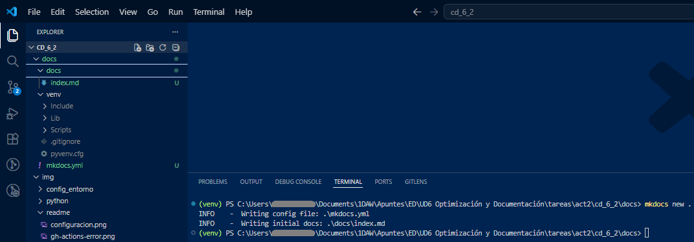
</div>

## Paso 3 - Configuración de MkDocs

Para configurar el MkDocs, insertamos el fragmento siguiente en el archivo `mkdocs.yml`, configurando así el tema Material.

```yml
site_name: Mi Documentación
theme:
  name: material
  features:
    - navigation.tabs
    - navigation.sections
    - navigation.expand
    - content.code.copy
```

<div align="center">
 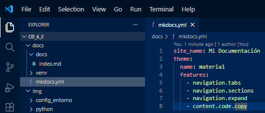
</div>

## Paso 4 - Creación de la Estructura de Documentación

Pasamos a crear la estructura de directorios y archivos mostrada en el enunciado.

<div align="center">
 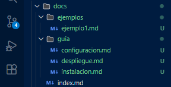
</div>

A continuación se edita el archivo `docs\index.md`:

<div align="center">
 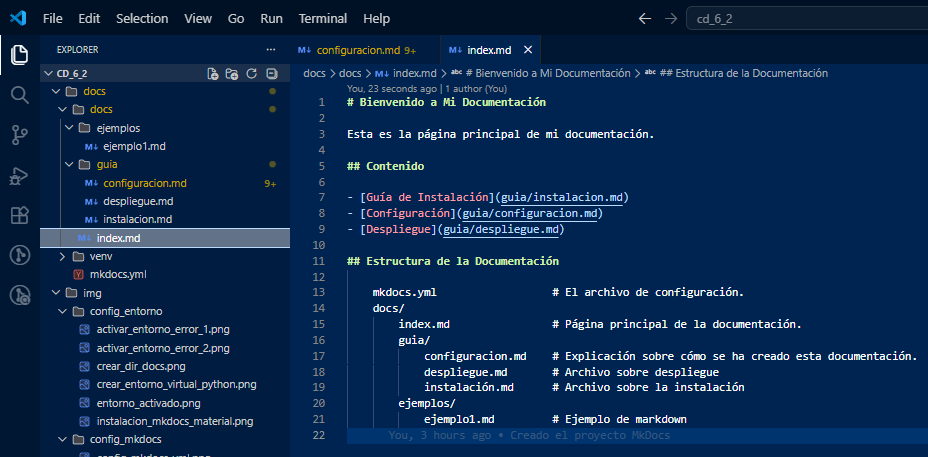
</div>

En este punto también se pide rellenar los archivos `despliegue.md` e `instalacion.md` con algún contenido. Puede comprobar que ambos tienen contenido, el cuál ha sido generado con el chatbot de IA generativa ChatGPT.

## Paso 5 - Creación del repositorio en GitHub

1. **Inicialización del repositorio en GitHub.** En este punto, debemos crear el repositorio remoto en GitHub para subir el contenido de esta documentación. En mi caso, como ya lo he hecho previamente, se muestra una prueba de ello.

<div align="center">
 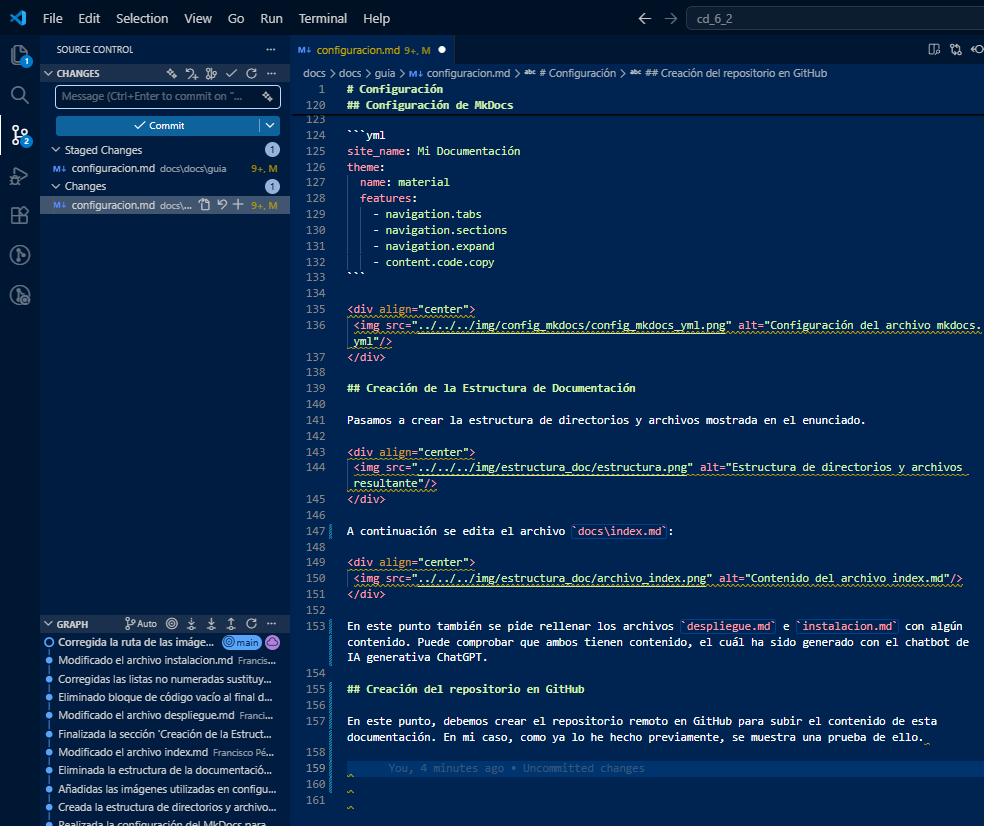
</div>

Puede acceder al repositorio remoto haciendo click sobre [este enlace](https://github.com/fperez1291/cd_6_2).

2. **Archivo `.gitignore`.** Se crea un archivo `.gitignore` para que git ignore la carpeta `venv\` junto con su contenido (el entorno virtual).

<div align="center">
 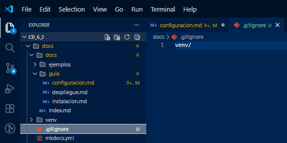
</div>

3. **Primer commit.** Como ya he mencionado, esta documentación ya está subida a GitHub. Sin embargo, se muestra el próximo commit:

<div align="center">
 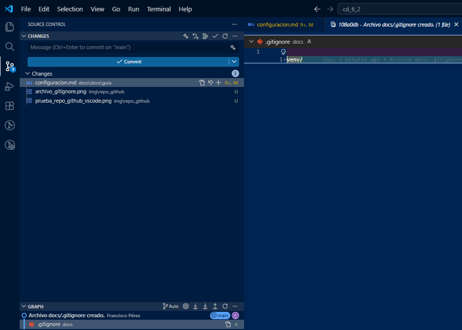
</div>

## Paso 6 - Automatización del despliegue: GitHub Actions

Para automatizar el despliegue en GitHub Actions crearemos un archivo `.github/workflows/deploy.yml` en el directorio raíz dek repositorio.

<div align="center">
 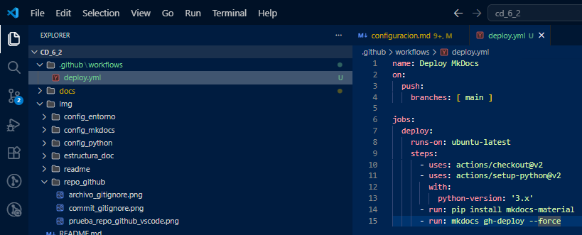
</div>

## Paso 7 - Configurando GitHub Actions

En este paso deberemos acceder al nuestro repositorio en GitHub, entrar a la sección de configuración del repositorio (`Settings`), desplegar la lista de la opción `Actions`en la barra lateral, seleccionar la opción `General`y en la sección de `General` con nombre `Workflow permissions` se debe seleccionar la opción `Read and write permissions`.

<div align="center">
 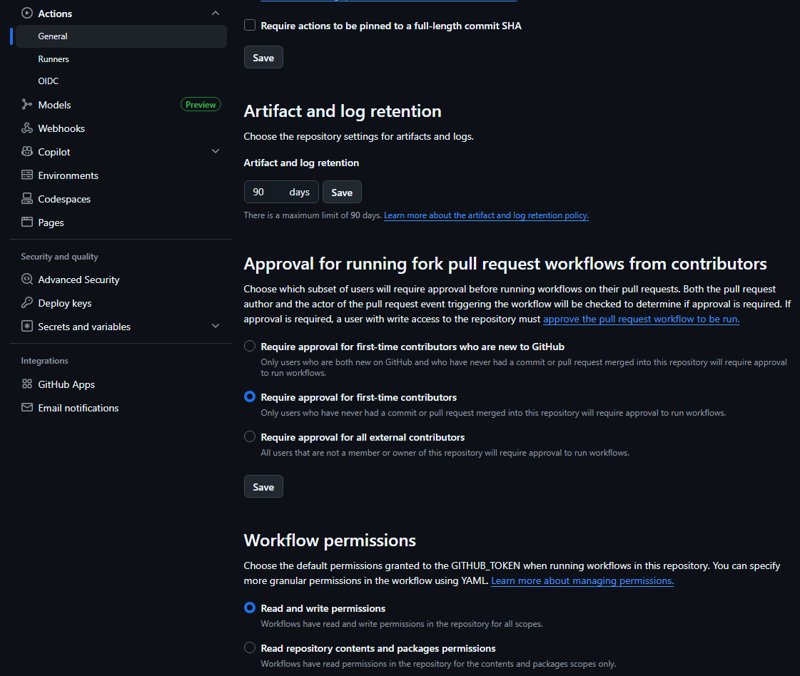
</div>

Una vez cambiados los `Workflow permissions`, debe pulsar el botón `Save`para guardar los cambios.

<div align="center">
 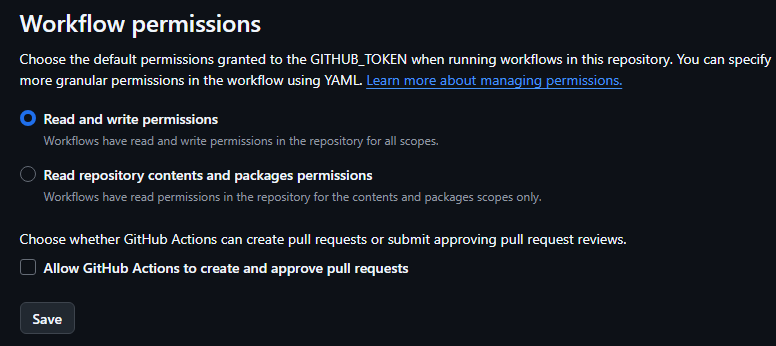
</div>
